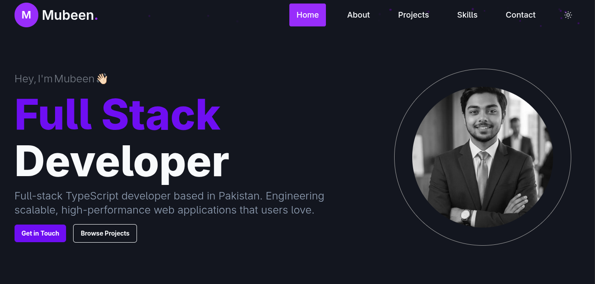

# Mubeen — Full-Stack Developer Portfolio

A fast, responsive portfolio website for **Mubeen**, a full-stack TypeScript developer based in Faisalabad, Pakistan. It highlights selected work, technical skills, and ways to connect.

**[View the live site](https://portfolio-beryl-eta-zuq6c5ksg2.vercel.app)** · **[Browse projects](https://portfolio-beryl-eta-zuq6c5ksg2.vercel.app/projects)**



## Highlights

- Responsive, accessible single-page portfolio with a dedicated projects route
- Dark and light themes with persisted theme preference
- Animated sections and polished interaction states
- Search-engine and social-sharing metadata, including Open Graph, Twitter cards, sitemap, robots file, and Person JSON-LD
- Downloadable résumé and direct contact/social links
- Project cards linking to source code and live previews where available

## Built with

- [Next.js 16](https://nextjs.org/) and [React 19](https://react.dev/)
- [TypeScript](https://www.typescriptlang.org/)
- [Tailwind CSS 4](https://tailwindcss.com/)
- [Motion](https://motion.dev/) and [AOS](https://michalsnik.github.io/aos/) for animation
- [next-themes](https://github.com/pacocoursey/next-themes) for color-mode support

## Run locally

### Prerequisites

- Node.js 20.9 or later
- npm

### Installation

```bash
git clone https://github.com/MubeenBhatti563/portfolio.git
cd portfolio
npm install
npm run dev
```

Open [http://localhost:3000](http://localhost:3000) in your browser.

## Available commands

| Command | Description |
| --- | --- |
| `npm run dev` | Start the local development server. |
| `npm run build` | Create an optimized production build. |
| `npm run start` | Serve the production build. |
| `npm run lint` | Run ESLint checks. |

## Project structure

```text
src/
├── app/                 # App Router pages, metadata, sitemap, and global styles
├── components/
│   ├── sections/        # Hero, About, Projects, Skills, Contact, Navbar, Footer
│   └── ui/              # Theme, animation, and reusable UI helpers
├── constants/           # Skills, featured projects, contact, and social data
├── hooks/               # Custom React hooks
├── lib/                 # Shared utilities
└── types/               # TypeScript models
public/                  # Images, technology icons, and résumé
```

## Customize it

The content is deliberately data-driven. Update these files to tailor the portfolio:

| What to change | Location |
| --- | --- |
| Featured projects | `src/constants/projectsData.ts` |
| Skills and icons | `src/constants/skills.ts` |
| Social links | `src/constants/socialsLinks.ts` |
| Contact details | `src/constants/Contact.ts` |
| Site title, SEO, and social preview metadata | `src/app/layout.tsx` |
| Résumé | `public/resume.pdf` |

## Contact

- [LinkedIn](https://www.linkedin.com/in/muhammad-mubeen-64633231a/)
- [GitHub](https://github.com/MubeenBhatti563)
- [Medium](https://medium.com/@mubeeniqbal563)
- [Email](mailto:mubeeniqbal563@gmail.com)

## License

This project is available for personal reference. Please ask before reusing its content, visual identity, or résumé.
